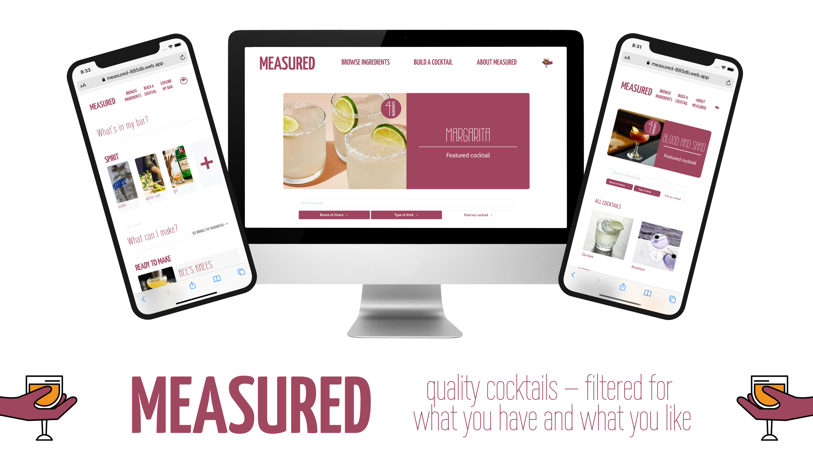
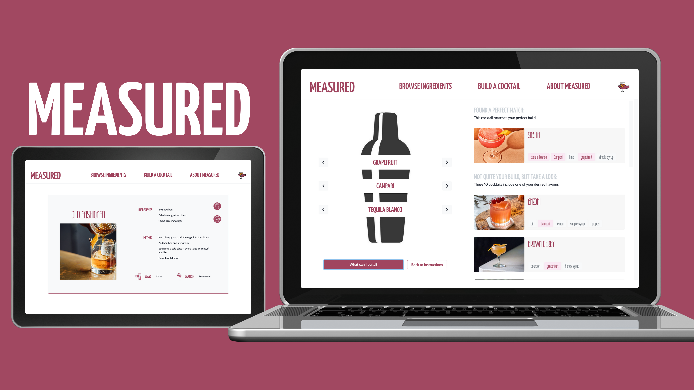
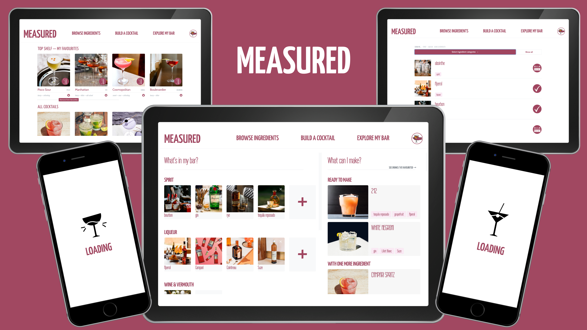

<!-- Remember to reflect any changes to the readme in the Table of Contents-->

# Measured



Measured is a responsive web app that gives you easy-to-use, easy-to-understand cocktail recipes, and lets you filter them for the ingredients you have and the flavours you like.

## Table of Contents

- [Live Demo](#Live-Demo)

- [Features](#Features)

- [Walkthrough](#Walkthrough)

- [Getting Started](#Getting-Started)

- [Tech Stack](#Tech-Stack)

- [Contributors](#Contributors)

- [License](#License)

## Live Demo

You can find a deployed version of this App [here](https://measured-885db.web.app/).



Client and server are hosted on [Firebase](https://firebase.google.com/). Our database is hosted through [Cloud Firestore](https://firebase.google.com/docs/firestore).

## Features



- Measured is all about quality, curated recipes, written in plain English — so you get all of the booze, less of the bullshit, and... definitely no blue cocktails.
- Our homepage displays a range of cocktail recipes, including a feature recipe, scrollable galleries of cocktails based on flavour/type, and — if you're logged in — a 'top shelf' of your favourite drinks.
- Anyone can browse the cocktail collection or look at instructions for individual drinks, which have badges to indicate the number of ingredients they include. You can use the search bar to dynamically filter or search specific recipes, based on name, ingredient or flavour category.
- Anyone can also use our build-a-drink cocktail creator, which provides instructions on the basic formula for different cocktails, and lets you test flavour combinations. It suggests cocktails from our collection based on your preferred 'build'.
- Users can create a Measured account or login through Google Authentication. Once logged in, you'll get access to our 'My Bar' page, which lets you browse ingredients, add the ones you have at home, and suggests cocktails you can make based on the ingredients you already have.

## Walkthrough

Measured was developed as a Thesis Project for the coding bootcamp [Codeworks](https://codeworks.me/) by [Chris Perry](https://github.com/chrisperry-sd), [Stephen Matthews](https://github.com/smatthews5) and [Jill Masters](https://github.com/jillmasters).

<div width="100%"></div>

You can watch the presentation of the project below, produced after 12 days of development:

<div width="100%"><a href="https://www.youtube.com/watch?v=T0dUa8-gh5Y"></a></div>

## Getting Started

These instructions will help you setup a local development instance of Measured.

### Get the repo

```bash
git clone https://github.com/smatthews5/measured.git
```

### Install dependencies

```bash
npm install
```

### Run the app

```bash
npm start
```

## Tech Stack

### Front End

- [TypeScript](https://www.typescriptlang.org/)
- [React](https://reactjs.org/)
- [ChakraUI](https://next.chakra-ui.com/)

### Back End

- [Firebase](https://firebase.google.com/)
- [Cloud Firestore](https://firebase.google.com/docs/firestore)

## Contributors

- Jill Masters — [GitHub](https://github.com/jillmasters) | [LinkedIn](https://www.linkedin.com/in/jillchuahmasters/)
- Stephen Matthews — [GitHub](https://github.com/smatthews5) | [LinkedIn](https://www.linkedin.com/in/stephen-matthews5/)
- Chris Perry — [GitHub](https://github.com/chrisperry-sd) | [LinkedIn](https://www.linkedin.com/in/chrisdperry-sd/)

## License

This project is licensed under the ISC License.
